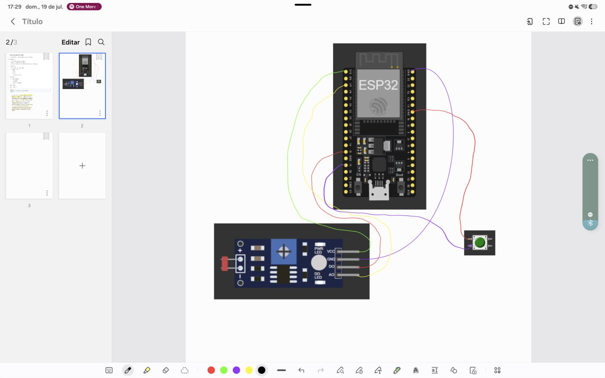

# Processo Seletivo – Intensivo Maker | IoT

## Relatório do Candidato
### Identificação do Candidato

- **Matheus Henrique dos Santos Nonato:**
- **GitHub: https://github.com/Henrique7613**

---

## Visão Geral da Solução

 **Descreva, em poucas palavras:**

  **Qual é o objetivo do seu projeto?**

    Contabilizar objetos em uma esteira de produção.

  **O que o sistema embarcado simulado faz?**

    Identificar, usando variações de luminosidade, a passagem de objetos, micro-paradas nas linhas de produção e o reset pós turno dos contadores.

  **Como o usuário interage com ele (se aplicável)?**

    Via terminal.
---

## Arquitetura do Sistema Embarcado

Explique a arquitetura lógica do seu projeto, abordando:

- Fluxo principal do programa (`main.py`)
- Estrutura de estados, loops ou temporizações
- Como os componentes interagem entre si

Se desejar, utilize tópicos ou um pequeno diagrama em texto.

---

## Componentes Utilizados na Simulação

Liste os principais componentes definidos no `diagram.json`, por exemplo:

- Tipo de placa utilizada
- LEDs, botões, sensores, atuadores, etc.
- Função de cada componente no sistema

---

## Decisões Técnicas Relevantes

Explique brevemente decisões importantes tomadas durante o desenvolvimento, como:

- Organização do código
- Uso de funções, estados ou constantes
- Estratégias para temporização ou controle lógico

---

## Resultados Obtidos

Descreva o comportamento final do sistema:

- O que funciona corretamente
- Quais requisitos foram atendidos
- Resultado observado na simulação do Wokwi

---

## Comentários Adicionais (Opcional)

Utilize este espaço para comentar, se desejar:
  Não estava esperando tão pouco tempo para fazer isso, tive que sair revisando tudo em cima e correndo, bem desconfortável na minha opinião, mas tudo bem.
  Achei os problemas propostos de fácil compreensão e resolução, no sentido de compreender sua natureza e o que deve ser feito para encontrar possíveis soluções.
  Abaixo está uma print de uma nota usada para organização do fluxo de pensamento.
  Considero essas ligações a maior dificuldade que tive
  

- Dificuldades encontradas
- Limitações da solução
- Melhorias que você faria com mais tempo
- Principais aprendizados durante o desafio

---

> Este relatório faz parte da avaliação técnica.  
> Clareza, objetividade e organização são tão importantes quanto o funcionamento do código.

